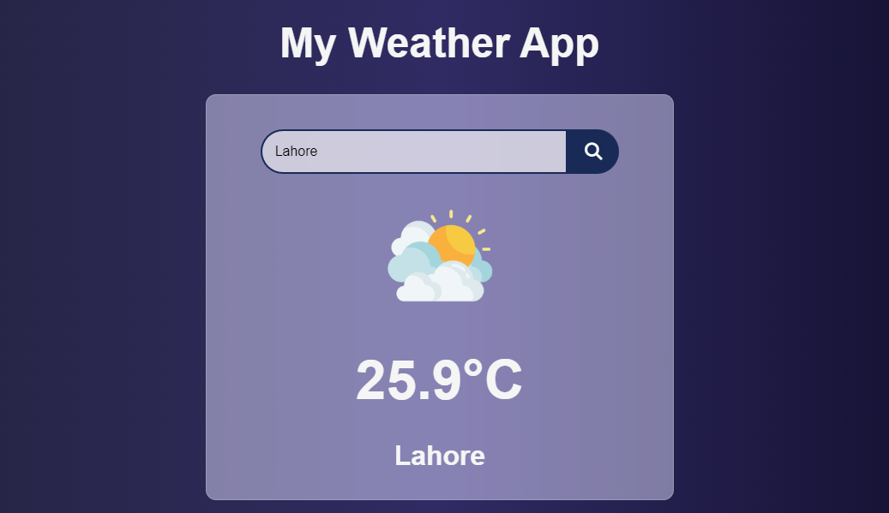

# Weather App

Weather App is a simple web application that allows users to search for the weather in different cities. The app provides real-time weather information, specifically displaying the temperature in Celsius. It's a handy tool for quickly checking the weather conditions in any location you're interested in.

## Features

- **City Search**: Users can enter the name of a city or location they want to check the weather for.

- **Temperature in Celsius**: The app displays the current temperature in Celsius for the searched city.

- **Clean and User-Friendly Interface**: The app has a straightforward and user-friendly design, making it easy for anyone to use.

## How to Use

1. Open the Weather App in your web browser.

2. You will see a search bar and a "Search" button on the main screen.

3. Enter the name of the city or location you want to check the weather for in the search bar.

4. Click the "Search" button or press Enter.

5. The app will fetch the current weather information for the provided city and display the temperature in Celsius on the screen.

6. You can enter another city and repeat the process to check the weather for different locations.

## Technologies Used

The Weather App is built using the following technologies:

- HTML: For the structure and layout of the web page.
- CSS: For styling and layout customization.
- JavaScript: For handling user interactions and making API requests.
- Weather API: The app fetches weather data from a weather API to provide real-time information.

## Installation

Since the Weather App is a web application, there is no need for installation. Users can simply access it through a web browser.

## Contributing

If you'd like to contribute to the Weather App, feel free to fork the repository, make your improvements, and submit a pull request. We welcome contributions and suggestions for enhancing the app's functionality and user experience.

## Acknowledgments

- Weather data is provided by [Weather API](https://www.weatherapi.com/).

#Thank You for visiting my repository!!!!
